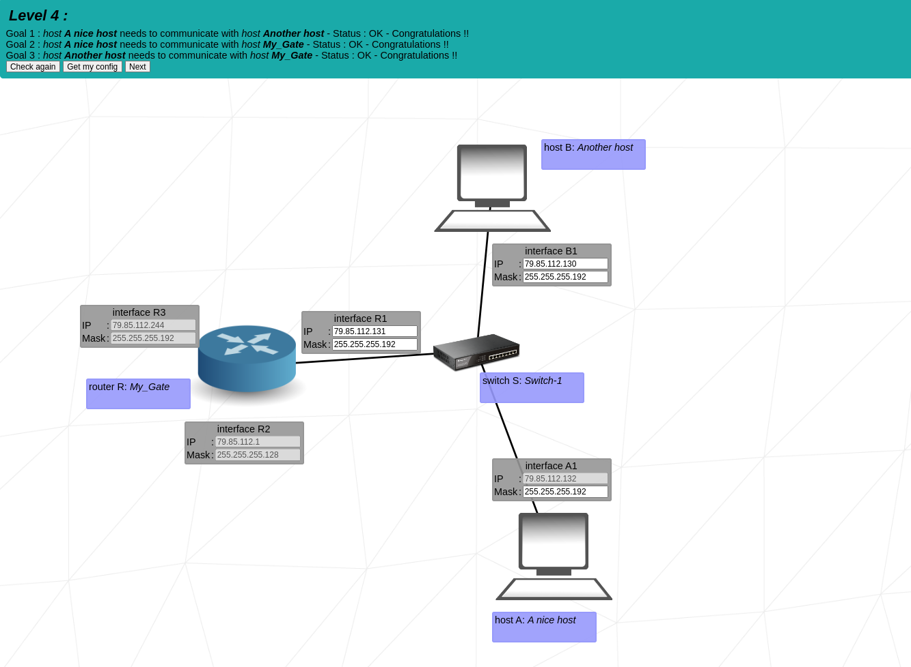

<h1>NetPractice [100 / 100]</h1>

   

## Summary

> <i>The tenth project in the 42sp fundamentals track, <strong>NetPractice</strong>, is about to configure small-scale networks divided into some levels, <i>
> <i>the first being the easiest and the tenth being the hardest. The main objective of this project is to introduce the study of <strong>Networks</strong>, <i>
> <i>covering some topics like <strong>IP Addresses</strong>, <strong>Subnet Mask</strong>, <strong>Router</strong>, <strong>Switches</strong>, and others. <i>

 

## The Project

* To configure the networks mentioned before, the project provides some web pages with incomplete network diagrams that we need to solve to go forward:

   <table>
     <tr>
       <td style="border: 5px solid darkgray;">
         
       </td>
     </tr>
   </table>

